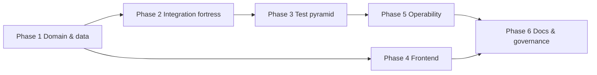

# Patron Loyalty — 6-phase roadmap to 10/10

Forward-looking plan to reach **10/10 across every rated dimension** for this repo (LMS split). Historical execution is tracked in [patron-loyalty-10-plan.md](./patron-loyalty-10-plan.md) (Phases 0–7, mostly complete as of 2026-06-28).

**Current baseline (~8.4 / 10 overall)** — Phase 1 started: account service split + Prisma loyalty layer file.

## PR tagging convention

Prefix commits and PR titles with phase IDs for traceability:

| Tag   | Meaning                        | Example                                       |
| ----- | ------------------------------ | --------------------------------------------- |
| `P1:` | Phase 1 — domain & data        | `P1: split loyalty-account lifecycle service` |
| `P2:` | Phase 2 — integration fortress | `P2: coupon contract tests`                   |
| `P3:` | Phase 3 — test pyramid         | `P3: queue-events matrix spec`                |
| `P4:` | Phase 4 — frontend             | `P4: axe audit login page`                    |
| `P5:` | Phase 5 — operability          | `P5: enable Sentry release tags`              |
| `P6:` | Phase 6 — docs & governance    | `P6: doc CI gate for QMS paths`               |

## Quarterly scorecard review

| Review date | Overall        | Notes                                                                |
| ----------- | -------------- | -------------------------------------------------------------------- |
| 2026-06-28  | 8.2            | Baseline after Phases 0–7                                            |
| 2026-06-28  | 8.4            | P1: account split + loyalty.prisma                                   |
| 2026-06-29  | 8.7            | P4: BFF auth + axe; P5: runbooks + soak; P6: ADRs + doc gate started |
| **Next**    | **2026-09-28** | Re-rate all dimensions; fix any below 9 before new features          |

**Rule:** If any dimension drops below **9**, open a focused phase task before adding features.

---

## Scorecard (now → target)

| Dimension                     | Now | Target | Primary phase |
| ----------------------------- | --- | ------ | ------------- |
| Multi-tenancy & security      | 9.0 | 10     | 1             |
| Integration design (QlessQ)   | 8.8 | 10     | 2             |
| Shared contracts              | 8.5 | 10     | 2             |
| Event-driven design           | 8.0 | 10     | 3             |
| Frontend (loyalty app)        | 8.0 | 10     | 4             |
| API modularity & cohesion     | 7.5 | 10     | 1             |
| Data layer                    | 7.5 | 10     | 1             |
| Service sizing (1k-line rule) | 7.5 | 10     | 1             |
| Test pyramid                  | 8.0 | 10     | 3             |
| Docs ↔ repo truth             | 8.5 | 10     | 6             |
| Operability & release         | 7.5 | 10     | 5             |

---

## Phase 1 — Domain & data excellence

**Goal:** Schema, services, and transactions read like a purpose-built LMS product — not a QMS split with loyalty bolted on.

**Duration:** 3–4 weeks

| Workstream                    | Actions                                                                                                                                                                               | Exit criterion                                                                   |
| ----------------------------- | ------------------------------------------------------------------------------------------------------------------------------------------------------------------------------------- | -------------------------------------------------------------------------------- |
| **Prisma clarity**            | Multi-file schema preview (`core.prisma`, `loyalty.prisma`, `qms.prisma`); tag every model with layer in docs                                                                         | Loyalty models discoverable without scrolling 1,750-line file                    |
| **Connector identity**        | Finish `customers.external_id` rollout; deprecate metadata JSON scan path behind feature flag; backfill audit script                                                                  | Zero integration lookups use `$queryRaw` metadata scan in prod                   |
| **Service decomposition**     | Split remaining large services: `loyalty-account.service.ts` (~505 LOC), `loyalty-points.service.ts` (~416), `loyalty-dashboard.service.ts` (~348) into ledger / tier / stats facades | No loyalty service file > 400 LOC; each file = one aggregate                     |
| **Use-case boundaries**       | Introduce thin application layer for earn/redeem/queue-event orchestration; transactions opened once per use-case                                                                     | Lint or review rule: no nested `withTenant` in domain services                   |
| **Module registry hardening** | Loyalty deploy image audit: boot log lists registered modules; integration test asserts QMS controllers absent when `API_DEPLOY_PROFILE=loyalty`                                      | Cold-start module list matches [REPO_BOUNDARIES.md](./REPO_BOUNDARIES.md) matrix |

**Score impact:** Data layer 7 → 10, API modularity 7.5 → 9.5, Service sizing 7 → 10

---

## Phase 2 — Integration & contract fortress

**Goal:** The QlessQ connector is boringly reliable; every external write path is machine-verified.

**Duration:** 2–3 weeks

| Workstream                     | Actions                                                                                                                                               | Exit criterion                                             |
| ------------------------------ | ----------------------------------------------------------------------------------------------------------------------------------------------------- | ---------------------------------------------------------- |
| **HTTP contract suite**        | Extend supertest coverage to all `/loyalty/integrations/v1/*` routes (redeem, wallet, coupons); negative paths per Zod field                          | 100% integration routes have ≥1 happy + ≥1 validation test |
| **Golden-path integration**    | DB-backed tests: queue-events idempotency, earn replay, external_id lookup (with `INTEGRATION_DATABASE_URL`)                                          | CI job optional but documented; runs in pre-release audit  |
| **API key lifecycle**          | Rotation endpoint, `lastUsedAt` on key hash, staff UI surfacing prefix + rotation                                                                     | Operators rotate keys without downtime; audit log entry    |
| **Connector observability v2** | Wire `recordClientError` on guard + validation failures; ingest metrics query doc in [QLESSQ_CONNECTOR_OPS.md](../operations/QLESSQ_CONNECTOR_OPS.md) | 4xx spikes fire on bad payloads, not only handler errors   |
| **QlessQ sibling contract**    | Document retry/backoff, `{ idempotent: true }` semantics, `connectorVersion` bump process in shared + both repos                                      | Single source of truth in `@queueplatform/shared`          |

**Score impact:** Integration 8.8 → 10, Shared contracts 8.5 → 10

---

## Phase 3 — Test pyramid completion

**Goal:** Architecture assumptions are enforced by tests, not tribal knowledge.

**Duration:** 2–3 weeks

| Workstream               | Actions                                                                                                               | Exit criterion                                                         |
| ------------------------ | --------------------------------------------------------------------------------------------------------------------- | ---------------------------------------------------------------------- |
| **Unit coverage**        | Specs for every loyalty service without one: gamification edge cases, campaign dispatch, wallet, catalog redeem paths | `pnpm test` loyalty module coverage ≥ 80% lines (vitest coverage gate) |
| **Portal & staff flows** | Playwright: patron portal redeem, profile update, staff reward catalog edit, integrations page API key copy           | 5+ E2E specs in `@queueplatform/e2e`; run in CI `test-e2e-loyalty`     |
| **Queue-events matrix**  | Unit tests for all 6 QlessQ event types + skip/idempotent branches in `loyalty-queue-events.service.spec.ts`          | Event switch exhaustively tested (`never` default)                     |
| **RLS regression**       | `tenant-isolation.spec.ts` runs in CI when secrets available; loyalty-specific models added to policy checks          | No new loyalty table without RLS policy test                           |
| **Release gate**         | `pnpm test:ci` includes loyalty coverage threshold; `audit:patron-loyalty` runs full unit suite                       | Single command blocks release                                          |

**Score impact:** Test pyramid 8 → 10

---

## Phase 4 — Frontend & patron experience

**Goal:** Loyalty app matches enterprise bar for security, UX, and accessibility.

**Duration:** 2–3 weeks

| Workstream           | Actions                                                                                                   | Exit criterion                                                 |
| -------------------- | --------------------------------------------------------------------------------------------------------- | -------------------------------------------------------------- |
| **Auth consistency** | Remove in-memory JWT dependency where cookie-only suffices; document refresh vs impersonation flows       | No token in login/session JSON; impersonation handoff audited  |
| **CSP & headers**    | Tighten CSP (nonce scripts where needed); verify HSTS, frame-ancestors in prod                            | Security checklist item in launch doc; static spec green       |
| **Accessibility**    | axe audit on login, dashboard, portal; fix critical violations                                            | 0 critical a11y issues on core paths                           |
| **Performance**      | Bundle budget enforced in CI (`check:bundle-budgets` fails PR); React Query staleTime review on dashboard | Loyalty `.next` under budget; LCP < 2.5s on overview (staging) |
| **Error UX**         | Consistent toast + retry for transient 502/503; offline banner on portal                                  | No silent failures on earn/redeem UI actions                   |

**Score impact:** Frontend 8 → 10, Security 9 → 10

---

## Phase 5 — Operability & observability

**Goal:** Incidents are diagnosable in minutes; releases are traceable end-to-end.

**Duration:** 2 weeks (+ ongoing)

| Workstream               | Actions                                                                                               | Exit criterion                                                |
| ------------------------ | ----------------------------------------------------------------------------------------------------- | ------------------------------------------------------------- |
| **Sentry production**    | Enable `SENTRY_DSN` on `pl-api` + loyalty; set `SENTRY_RELEASE` = git SHA on Railway                  | Errors grouped by release; health/meta matches Sentry release |
| **Structured ops logs**  | Standardize JSON log fields (`orgId`, `requestId`, `route`, `durationMs`) on integration + auth paths | Log drain queries documented                                  |
| **Connector dashboards** | Railway/log queries: ingest rate, idempotent %, skip %, p95 latency, 4xx spike count                  | Runbook section with copy-paste queries                       |
| **Staging soak**         | Nightly workflow: boundary curls + queue-events smoke against staging (when secrets exist)            | GitHub Action green or skipped with reason                    |
| **Incident runbooks**    | Auth outage, migration failure, connector 4xx spike, Redis down — one page each in `docs/operations/` | On-call can follow without reading code                       |

**Score impact:** Operability 7.5 → 10, Integration ops 8.8 → 10

---

## Phase 6 — Documentation, compliance & governance

**Goal:** Repo truth matches production; compliance and architecture stay current without heroics.

**Duration:** 1–2 weeks (+ quarterly)

| Workstream                 | Actions                                                                                                                                          | Exit criterion                                        |
| -------------------------- | ------------------------------------------------------------------------------------------------------------------------------------------------ | ----------------------------------------------------- |
| **Doc hygiene**            | QMS-only banners on any remaining stale refs; auto-check script for `apps/web` paths in LMS docs                                                 | CI fails on docs implying QMS ships from this repo    |
| **Launch & compliance**    | [PATRON_LOYALTY_LAUNCH_CHECKLIST.md](../compliance/PATRON_LOYALTY_LAUNCH_CHECKLIST.md) synced with TESTING tiers, connector ops, migration steps | Pre-release audit = checklist walkthrough             |
| **Architecture scorecard** | Quarterly re-rate in this doc; link PRs that moved each dimension                                                                                | Next review date set (e.g. 2026-09-28)                |
| **ADR light**              | Short ADRs for: external_id migration, BFF auth model, connectorVersion, module registry                                                         | 4 ADRs in `docs/architecture/adr/`                    |
| **Agent & CI parity**      | `pnpm validate:ci` = what agents run; `AGENTS.md` points to TESTING.md + this roadmap                                                            | New contributor / agent reaches green path in one doc |

**Score impact:** Docs 8.5 → 10; governance sustains all other 10s

---

## Execution order (recommended)

1. **Phase 1** — highest structural ROI (unblocks clean tests and docs).
2. **Phase 2** — protects QlessQ revenue path while Phase 1 lands.
3. **Phase 3** — lock in behavior before UI churn.
4. **Phase 4** — parallelizable once auth/BFF stable (Phase 1 partial).
5. **Phase 5** — after tests exist to catch regressions during observability work.
6. **Phase 6** — continuous; formal pass at end of each quarter.

---

## Target scorecard (when all 6 phases complete)

| Dimension                | Target |
| ------------------------ | ------ |
| Multi-tenancy & security | 10     |
| Integration design       | 10     |
| Shared contracts         | 10     |
| Event-driven design      | 10     |
| Frontend                 | 10     |
| API modularity           | 10     |
| Data layer               | 10     |
| Service sizing           | 10     |
| Test pyramid             | 10     |
| Docs & governance        | 10     |
| Operability              | 10     |
| **Overall**              | **10** |

---

## Phase completion checklist (copy for tracking)

- [ ] **Phase 1** — Schema split preview; no service > 400 LOC; external_id only
- [x] **Phase 1 (partial)** — `loyalty-account` split into lifecycle/earn/dsar; `models/loyalty.prisma`
- [x] **Phase 1 (partial)** — Prisma layers: `core`, `qms`, `qms-services`, `billing`, `notifications`, `ops`; points/dashboard splits
- [ ] **Phase 2** — Full integration contract suite; API key rotation; 4xx spike wired
- [x] **Phase 2 (partial)** — Integration HTTP contracts (19 routes); `recordClientError` on validation 4xx; API key `lastUsedAt`
- [ ] **Phase 3** — 80% loyalty coverage; 5+ E2E specs; queue-events matrix tested
- [x] **Phase 3 (partial)** — `loyalty-queue-events.service.spec.ts` matrix (6 events, idempotent/skip branches)
- [x] **Phase 3 (partial)** — Loyalty module coverage gate (`pnpm audit:loyalty-coverage`, istanbul baseline ~32% lines — ratchet toward 80%)
- [x] **Phase 3 (partial)** — DB golden-path earn/idempotency spec (`loyalty-integration.integration.spec.ts`, `INTEGRATION_DATABASE_URL`)
- [x] **Phase 3 (partial)** — CI: loyalty coverage gate + DB golden-path in `test-api`; integrations E2E in `test-e2e-loyalty`
- [ ] **Phase 4** — a11y + bundle budget; cookie-only auth documented
- [x] **Phase 4 (partial)** — integrations page shows API key `lastUsedAt` + stale hint
- [x] **Phase 4 (partial)** — cookie-only BFF: login/refresh JSON strip tokens; `/api/auth/token` sync; [LOYALTY_AUTH_BFF.md](../architecture/LOYALTY_AUTH_BFF.md)
- [x] **Phase 3 (partial)** — `loyalty-integration.controller` delegation + ingest observability unit spec
- [x] **Phase 4 (partial)** — axe E2E on login, overview (smoke creds), portal
- [ ] **Phase 5** — Sentry prod; staging soak; incident runbooks
- [x] **Phase 5 (partial)** — `verify-sentry-prod.mjs` + `railway-sync-sentry-env.sh` for pl-api/pl-loyalty
- [x] **Phase 5 (partial)** — Incident runbooks (`docs/operations/incidents/`); `pnpm audit:staging-soak`; log queries in connector ops
- [ ] **Phase 6** — ADRs; quarterly scorecard; doc CI gate
- [x] **Phase 6 (partial)** — 4 ADRs in `docs/architecture/adr/`; `check:architecture:lms-doc-boundaries`; AGENTS.md → TESTING + roadmap

---

## Relationship to prior plan (Phases 0–7)

| Prior phase               | Status  | Absorbed into           |
| ------------------------- | ------- | ----------------------- |
| 0 Truth & gates           | ✅      | Phase 6                 |
| 1 Product boundary        | ✅      | Phase 1 (hardening)     |
| 2 Domain layering         | ✅      | Phase 1 (finish splits) |
| 3 Data & schema           | Partial | Phase 1                 |
| 4 Auth hardening          | ✅      | Phase 4                 |
| 5 Contract tests          | ✅      | Phase 2 + 3 (expand)    |
| 6 Connector observability | ✅      | Phase 2 + 5 (v2)        |
| 7 Operability             | Partial | Phase 5 + 6             |

---

## Recommendations

1. **Start Phase 1 immediately** — split `loyalty-account.service.ts` and land Prisma multi-file preview; everything else gets easier.
2. **Track this doc in PR descriptions** — reference phase number when closing work (e.g. `P2: integration coupon contract tests`).
3. **Quarterly re-rate** — update the scorecard table at the top; if a dimension slips below 9, open a focused phase task before adding features.
